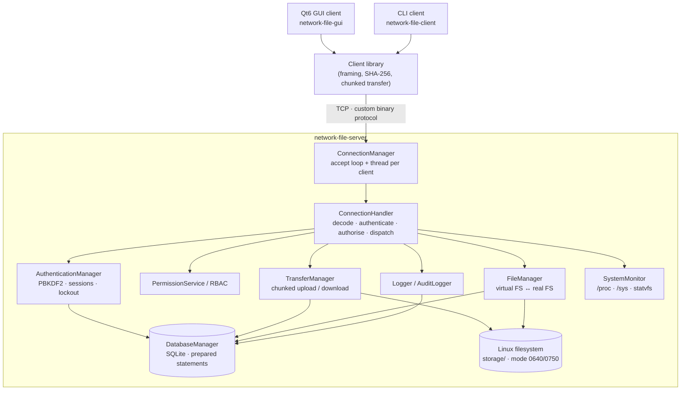
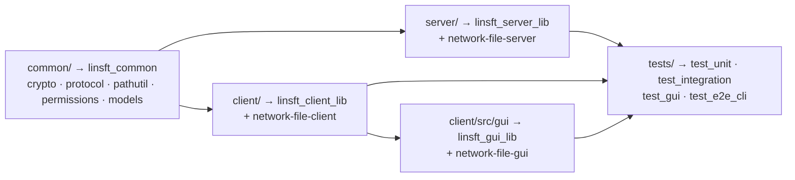
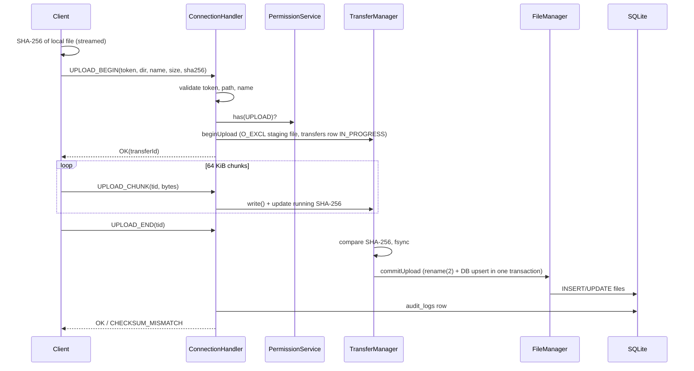
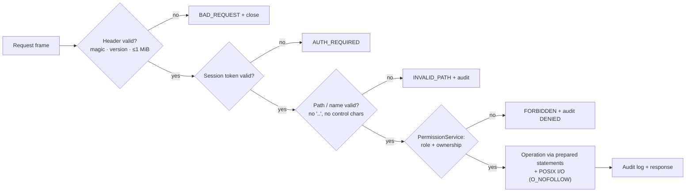
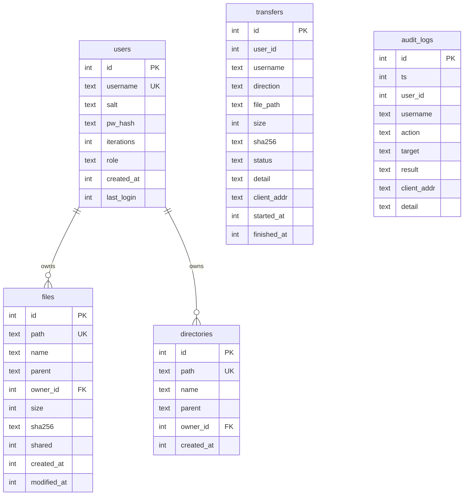

# LinSFT — Linux Secure File Transfer and System Monitoring Platform

A Linux-only, C++17 secure network file-sharing system: a multi-threaded TCP server with a custom
binary protocol, SQLite metadata, role-based access control, SHA-256 integrity checking, a Qt6
desktop GUI and a full command-line client.

> **Platform:** Ubuntu 24.04 / WSL2 Ubuntu 24.04. **Application language:** C++17 only (build scripts are Bash/CMake).
> **Kernel note:** LinSFT does **not** ship or require a kernel module. See [Linux Device Driver concepts](#5-linux-concepts-used) for what it honestly does instead.

---

## Contents

1. [Project overview](#1-project-overview) · 2. [Features](#2-features) · 3. [Architecture](#3-architecture) · 4. [Technology stack](#4-technology-stack) ·
5. [Linux concepts used](#5-linux-concepts-used) · 6. [Security model](#6-security-model) · 7. [RBAC model](#7-rbac-model) · 8. [Database schema](#8-database-schema) ·
9. [Build instructions](#9-build-instructions) · 10. [Run instructions](#10-run-instructions) · 11. [CLI usage](#11-cli-usage) · 12. [GUI usage](#12-gui-usage) ·
13. [Demo credentials / setup](#13-demo-credentials--setup) · 14. [Testing](#14-testing) · 15. [Troubleshooting](#15-troubleshooting) ·
16. [Limitations](#16-project-limitations) · 17. [Future enhancements](#17-future-enhancements)

More detail: [`docs/ARCHITECTURE.md`](docs/ARCHITECTURE.md), [`docs/SECURITY.md`](docs/SECURITY.md), [`docs/TESTING.md`](docs/TESTING.md),
[`docs/DEMO.md`](docs/DEMO.md), [`docs/UML.md`](docs/UML.md), [`docs/PRD.md`](docs/PRD.md), [`docs/DEVELOPMENT_PLAN.md`](docs/DEVELOPMENT_PLAN.md).

---

## 1. Project overview

Users register, log in and share files through a server that stores real files on the Linux filesystem and
tracks ownership, checksums, transfers and audit events in SQLite. Every upload and download is verified end-to-end with
SHA-256. What a user can see and do depends on their role (`STUDENT`, `FACULTY`, `ADMIN`), enforced centrally on the server.

## 2. Features

| Area | Implemented and tested |
|---|---|
| Authentication | Register, login, logout, random 256-bit session tokens, idle expiry, brute-force lockout (5 failures → 60 s) |
| RBAC | `ADMIN` / `FACULTY` / `STUDENT`, one central `PermissionService`, role changes apply to live sessions |
| Files | Upload, download, list, search, info, rename, delete, share/unshare (private by default) |
| Directories | Create, remove (empty only), rename (descendants follow) |
| Administration | List users, change role, delete user (files reassigned), last-admin protection, audit log |
| Monitoring | Per-user transfer history (all users for faculty/admin), audit trail, **System Monitor** (`/proc`, `/sys`, `statvfs`) |
| Integrity | SHA-256 streamed on both ends; mismatch ⇒ file rejected / local copy deleted |
| Networking | TCP, custom binary protocol, thread-per-client, 1 MiB payload cap, 64 KiB chunks, idle timeout, client limit |
| Clients | Qt6 GUI (`network-file-gui`) and CLI (`network-file-client`) – same client library |
| Robustness | `SIGINT`/`SIGTERM` graceful shutdown, no fd/thread/staging-file leaks, stale-transfer recovery on start-up |

## 3. Architecture



**Component diagram** (source layout → CMake targets)



**Upload sequence** (download is symmetric; the client verifies the server-supplied checksum)



**Data flow & security flow**



**Database ER diagram**


(`transfers` and `audit_logs` deliberately have no foreign key so history survives user deletion.)

## 4. Technology stack

C++17 (g++ 13) · CMake ≥ 3.16 · POSIX sockets/threads (`std::thread`) · SQLite 3 · Qt 6 Widgets (GUI) · Bash (scripts only).
No third-party crypto library: SHA-256, HMAC and PBKDF2 are implemented in `common/src/crypto.cpp` and verified against NIST/RFC test vectors.

## 5. Linux concepts used

| Concept | Where |
|---|---|
| TCP sockets: `socket/bind/listen/accept4/connect/send/recv`, `getsockname`, `SO_REUSEADDR`, `SO_RCVTIMEO`, `TCP_NODELAY`, `MSG_NOSIGNAL` | `server/src/server.cpp`, `common/src/protocol.cpp`, `client/src/client.cpp` |
| `poll()` accept loop with 200 ms wake-up so shutdown is prompt | `ConnectionManager::run` |
| POSIX file I/O: `open` (`O_EXCL`, `O_NOFOLLOW`, `O_CLOEXEC`), `read`, `write`, `fsync`, `close`, `fstat`, `lseek`, `rename`, `unlink`, `mkdir`, `rmdir` | `TransferManager`, `FileManager` |
| Linux permissions: files `0640`, directories `0750`, DB `0600`, credentials file `0600` | created with explicit modes |
| Threads and synchronisation: thread-per-client, `std::mutex`, `std::recursive_mutex` (DB), per-connection `TransferContext` | `ConnectionManager`, `DatabaseManager`, `FileManager` |
| Signals: `sigaction` for `SIGINT`/`SIGTERM` (graceful stop), `SIGPIPE` ignored | `server/src/main.cpp` |
| Resource cleanup: RAII for fds/statements/transactions; sockets shut down and threads joined on stop | everywhere |
| procfs / sysfs / `statvfs`: `/proc/meminfo`, `/proc/loadavg`, `/proc/uptime`, `/proc/self/status`, `/proc/devices`, `/sys/block/*` | `SystemMonitor` |
| Terminal control: `termios` (no-echo password prompt) | CLI client, `--init-admin` |

### Linux Device Driver concepts — what is real and what is not

* **No kernel module is included, and none is claimed.** Writing one would require kernel headers, `insmod` privileges and (on WSL2) a custom kernel — unsafe and unnecessary for this project.
* **What LinSFT genuinely does with drivers (from user space):**
  * Reads entropy from the **`/dev/urandom` character device** (`open`/`read`) for salts and session tokens. The System Monitor shows its major/minor numbers and the kernel driver that owns that major, parsed from `/proc/devices`.
  * Enumerates **block devices** through sysfs (`/sys/block/*/size`, `queue/rotational`, `dev`) and maps their major numbers to block drivers via `/proc/devices`.
  * Queries the storage filesystem with `statvfs(2)`.
* Architecture note (documented, not implemented): a char-device driver exposing transfer counters via `ioctl` would sit below the same user-space `SystemMonitor` interface; see `docs/ARCHITECTURE.md`.

## 6. Security model

Summary (full detail in [`docs/SECURITY.md`](docs/SECURITY.md)):

* **Passwords:** random 16-byte salt per user, PBKDF2-HMAC-SHA256 (100 000 iterations), constant-time comparison; plaintext never stored or logged. Unknown users cost the same CPU as wrong passwords.
* **Sessions:** 256-bit random tokens from `/dev/urandom`, validated on *every* request, 30 min idle expiry, revoked on logout / user deletion, role changes take effect immediately.
* **Brute force:** 5 failed logins ⇒ 60 s lockout per username.
* **Path safety:** all paths are virtual, canonicalised and *rejected* if they contain `..`, backslashes, control characters or hidden (`.`-prefixed) names; files are opened with `O_NOFOLLOW`; symlinks planted in storage are never followed.
* **Integrity:** SHA-256 computed by sender and receiver; uploads are staged in `storage/.tmp` and only `rename(2)`d into place after the checksum matches.
* **SQL:** every statement is prepared with bound parameters; no string-built SQL with user data (`instr()` replaces `LIKE` so search has no wildcard injection).
* **Protocol:** magic + version check, 1 MiB payload cap, bounds-checked reader, unknown/truncated frames handled without crashing; malformed frames close the connection cleanly.
* **Audit:** logins, logouts, every file operation and every *denied* or *rejected* attempt are written to `audit_logs` and the server log (control characters stripped to prevent log forging).
* **Transport:** plain TCP (no TLS) — see [limitations](#16-project-limitations). The default bind address is `127.0.0.1`.

## 7. RBAC model

| Permission | STUDENT | FACULTY | ADMIN |
|---|:-:|:-:|:-:|
| Login / logout, list, search, info, upload, download (permitted files) | ✔ | ✔ | ✔ |
| Create directories; rename / delete / share **own** files; remove **own** directories | ✔ | ✔ | ✔ |
| Read private files of other users | – | ✔ | ✔ |
| View transfer history of **all** users | – (own only) | ✔ | ✔ |
| System Monitor | – | ✔ | ✔ |
| Rename / delete / share **any** file, remove any directory | – | – | ✔ |
| User management (list, set role, delete), audit log | – | – | ✔ |

*Visibility rule:* a file is readable by its owner, by everyone if the owner marked it **shared**, and by faculty/admin. Files are private by default.
All rules live in `common/src/permissions.cpp` (`PermissionService`); handlers never compare role names themselves. The GUI uses the same table only to **hide** controls the role lacks.

## 8. Database schema

See [`database/schema.sql`](database/schema.sql) (embedded into the server at build time) and the ER diagram above.
Tables: `users`, `files`, `directories`, `transfers`, `audit_logs`.

## 9. Build instructions

Ubuntu 24.04 / WSL2 Ubuntu 24.04 — exact commands:

```bash
sudo apt update
sudo apt install -y build-essential cmake pkg-config libsqlite3-dev sqlite3 qt6-base-dev
# (WSL2 + Windows 11 / recent Windows 10 includes WSLg, so the GUI works out of the box)

unzip LinSFT-Final.zip && cd LinSFT
mkdir -p build && cd build
cmake ..
make -j$(nproc)
cd ..
```

or simply `./scripts/setup.sh && ./scripts/build.sh`. Add `--no-gui` to `build.sh` (or `cmake -DLINSFT_BUILD_GUI=OFF ..`) to build without Qt.
If Qt6 is missing, CMake prints a warning and still builds the server and CLI.
Build output is placed in `build/bin/`, and convenience symlinks `./network-file-server`, `./network-file-client`, `./network-file-gui` are created in the project root.

## 10. Run instructions

```bash
# one-time: create demo accounts (random passwords, saved to config/demo-credentials.txt, mode 0600)
./network-file-server --seed-demo

# Terminal 1
./network-file-server              # listens on 127.0.0.1:9090 ; Ctrl+C stops it gracefully

# Terminal 2
./network-file-gui                 # Qt6 desktop client
# or the guaranteed CLI fallback:
./network-file-client
```

`./scripts/run_demo.sh` does all of this in one command. Options: `--config FILE`, `--port N`, `--bind ADDR`, `--quiet`.
Remote access: set `bind_address = 0.0.0.0` in `config/server.conf` and start clients with `--host SERVER_IP`.

## 11. CLI usage

```text
register <user>            create a STUDENT account (prompts for password)
login <user> | logout | whoami
ls [path]  cd <path>  pwd  search <text>  info <path>
upload <local file> [remote dir] [--shared] [--overwrite]
download <remote file> [local path] [--overwrite]
rename <path> <new name>   rm <file>   mkdir <path>   rmdir <path>
share <file>   unshare <file>
history [n]
sysinfo                                       (FACULTY / ADMIN)
users | setrole <user> <STUDENT|FACULTY|ADMIN> | deluser <user> | audit [n]   (ADMIN)
```

Example session:

```text
$ ./network-file-client
linsft:/> login student1
Password: ********
Logged in as student1 (STUDENT)
student1@linsft:/> mkdir docs
student1@linsft:/> upload ~/report.pdf /docs --shared
upload complete, SHA-256 verified by server
student1@linsft:/> info /docs/report.pdf
```

## 12. GUI usage

`./network-file-gui [--host HOST] [--port PORT]`

1. **Login dialog** — enter server/port, username and password, **Login**; or **Register** to create a STUDENT account (signs you in).
2. **Files tab** — table of files/folders you may see. Double-click a folder to enter it, **Up** to go back, search box + **Search**/**Clear**.
   Buttons: **Upload**, **Download**, **File Info**, **Rename**, **Delete**, **Share / Unshare**, **New Folder**, **Remove Folder**, **Refresh**.
   Buttons are enabled only when the selection and your role allow the action.
3. **Transfer History** tab — your transfers (everyone's for faculty/admin) with status and checksum prefix.
4. **System Monitor** tab *(faculty/admin)* — live server + Linux host metrics.
5. **Users** and **Audit Log** tabs *(admin)* — change role, delete user, review every security event.
6. **Logout** (top-right or *Session* menu) returns to the login dialog.

Every visible control performs a real action; controls your role cannot use are hidden or disabled (verified by `test_gui`).

## 13. Demo credentials / setup

No password is hard-coded anywhere. Choose one of:

| Goal | Command |
|---|---|
| Demo accounts `admin`, `faculty1`, `student1` with **random** passwords | `./network-file-server --seed-demo` → printed once and saved to `config/demo-credentials.txt` (mode 0600, git-ignored). Re-running generates **new** passwords (this is also the *reset* procedure). |
| Create / reset **one** admin with your own password | `./network-file-server --init-admin myadmin` (prompts, no echo). Non-interactive: `LINSFT_ADMIN_PASSWORD='…' ./network-file-server --init-admin myadmin` |
| Normal-user demo | Click **Register** in the GUI (or `register alice` in the CLI) — self-registration always creates a `STUDENT`. |

Run these commands while the server is **stopped** (recommended; a running server keeps its in-memory sessions, so changed credentials only apply to new logins).
Full reset: stop the server, then `rm -rf data/* storage/* logs/*` (keeps the `.gitkeep` files) and seed again.

## 14. Testing

```bash
cd build && ctest --output-on-failure        # runs all four suites (GUI suite uses QT_QPA_PLATFORM=offscreen automatically)
```

| Suite | What it proves |
|---|---|
| `test_unit` (13 cases, 190 checks) | SHA-256 / HMAC / PBKDF2 against NIST & RFC vectors, protocol framing, malformed-frame handling over real sockets, path validation, full RBAC matrix, SQLite prepared statements, SQL-injection strings, transactions |
| `test_integration` (23 cases, 538 checks) | A real server on a real TCP port: register/login/logout, token replay/forgery, lockout, upload/download + SHA-256 (empty, odd-size, chunk-aligned files), checksum mismatch, tampered storage, path traversal, symlink planting, ownership & visibility, rename/delete/mkdir/rmdir/search/info, history scoping, admin user management, audit trail, hostile network input, mid-transfer disconnect, 12 concurrent clients, client limit, graceful shutdown, persistence, crash recovery, Unicode names |
| `test_gui` (6 cases, 105 checks) | Real Qt widgets (offscreen): login dialog, every dashboard action against a live server, role-based tab/button visibility, session loss |
| `test_e2e_cli` (39 checks) | The real `network-file-server` and `network-file-client` binaries: admin init, demo seeding, full user flow, faculty/admin features, 6 parallel CLI clients, **SIGINT** shutdown (exit code 0, port closed, no staging files) |

See [`docs/TESTING.md`](docs/TESTING.md) for the manual test plan and results.

## 15. Troubleshooting

| Symptom | Fix |
|---|---|
| `cmake` says Qt6 not found | `sudo apt install qt6-base-dev`, or build without GUI: `./scripts/build.sh --no-gui` |
| GUI: "could not connect to the display / xcb" | WSL2 needs WSLg (Windows 11 / current Windows 10). Update with `wsl --update` in PowerShell, then `wsl --shutdown`. Use `./network-file-client` meanwhile. |
| `bind 127.0.0.1:9090: Address already in use` | Another server instance is running: `pkill network-file-server`, or `--port 9091` on both server and client |
| Client says *Is network-file-server running?* | Start the server in another terminal; check host/port |
| Login says *too many failed attempts* | Wait 60 s (per-username lockout) |
| `database error` in client | See `logs/server.log`; make sure `data/` is writable |
| Want to start from scratch | Stop the server, `rm -rf data/* storage/* logs/*`, run `--seed-demo` again |

## 16. Project limitations

* **No TLS.** Traffic (including passwords) is unencrypted; use only on localhost/trusted networks or tunnel through SSH (`ssh -L 9090:127.0.0.1:9090 host`). TLS is the first item under future work.
* Thread-per-client model (capped by `max_clients`, default 64) — fine for a lab/classroom, not for thousands of connections.
* Sessions are in memory: restarting the server logs everyone out.
* Transfers are not resumable; one request in flight per connection (up to 8 open transfers).
* No quotas. Directory removal requires an empty directory (no recursive delete).
* The GUI performs network calls on the UI thread (it stays responsive during transfers via a progress dialog, but a stalled server blocks the window until the 30 s timeout).
* No kernel module (see section 5).

## 17. Future enhancements

TLS (OpenSSL) with certificate pinning · resumable/parallel transfers · epoll worker-pool server · per-user quotas ·
file versioning and trash · two-factor login · persistent sessions · a char-device driver or eBPF probe exporting transfer counters to the System Monitor · Windows-native client.

---

*License: MIT. Layout:* `client/ common/ server/ database/ config/ storage/ logs/ tests/ docs/ scripts/`
