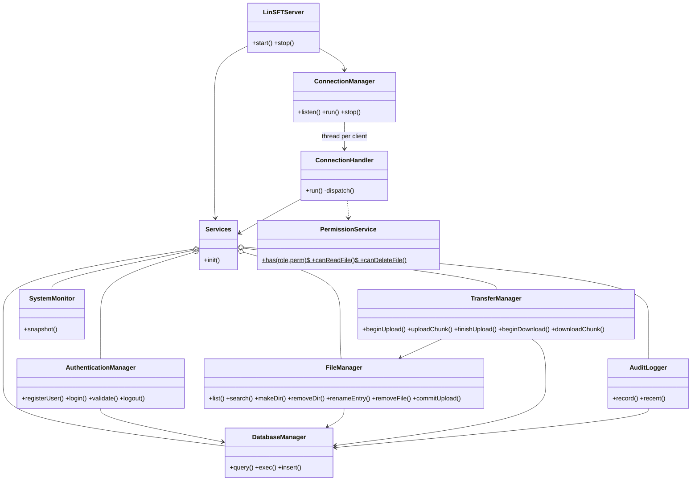
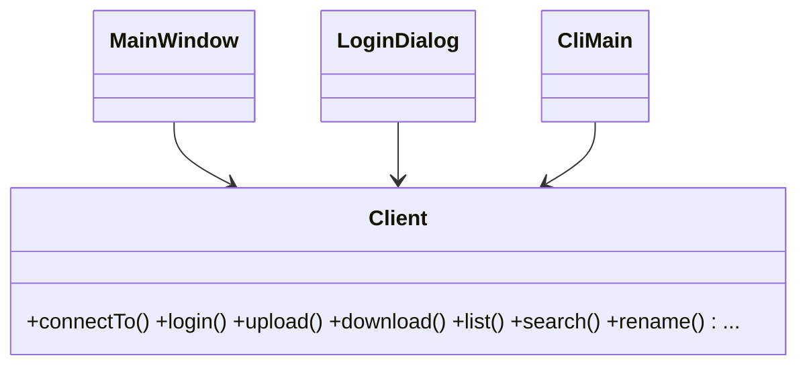
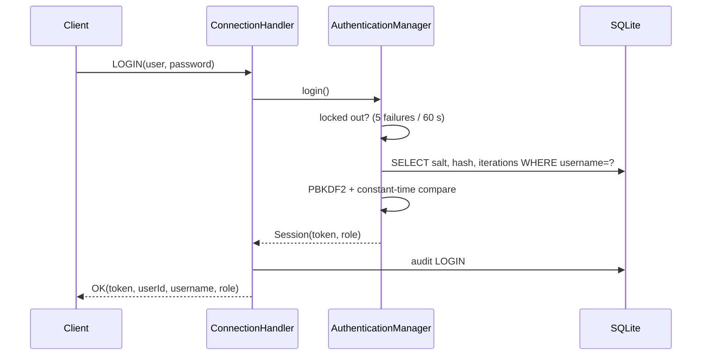
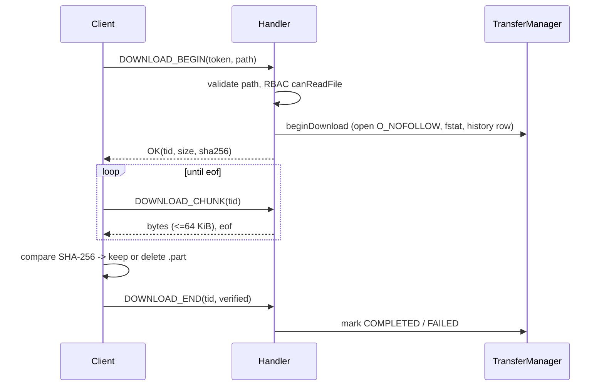
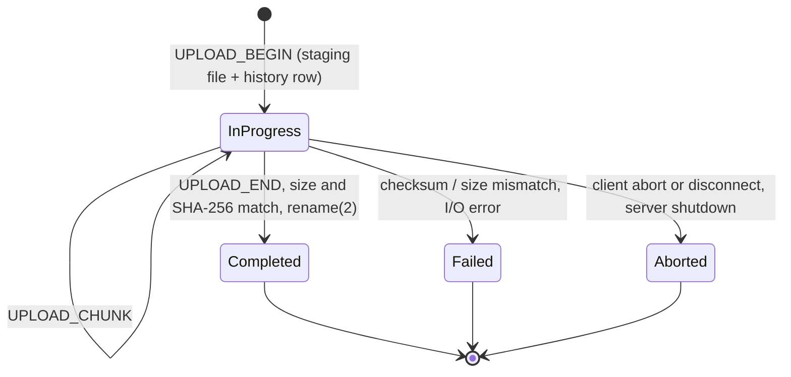
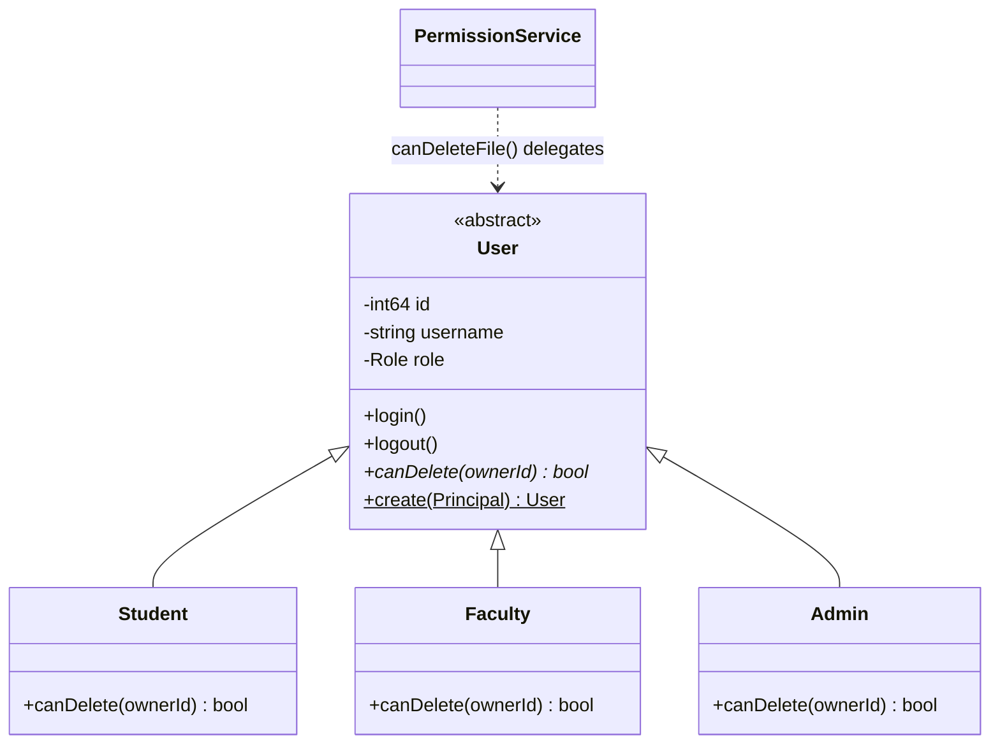

# UML

## Class diagram (server side)

## Class diagram (client side)

## Login sequence

## Download sequence

## Upload state machine

## User class hierarchy (OOP model)

`Student`/`Faculty` may delete only their own files; `Admin` may delete any. The password is deliberately **not** a member: only salted hashes exist, in the database.

## Mapping to the class names on the project poster
| Poster class | In this code base | Notes |
|---|---|---|
| `User` (abstract), `Admin`, `Faculty`, `Student` | `User`, `Admin`, `Faculty`, `Student` (`common/include/linsft/user.h`) | `login()`, `logout()`, `canDelete()` present; no password field (hashes only in DB) |
| `FileService` (upload, download, delete, rename, list, search, getFileInfo) | request handlers in `ConnectionHandler` + `FileManager` + `TransferManager` | split by responsibility |
| `FileManager` (openFile, readFile, writeFile, createDir, removeDir, getFileInfo) | `FileManager` (`makeDir`, `removeDir`, `find`, `list`, …) and POSIX `open/read/write` in `TransferManager` | |
| `AuthenticationService` (authenticate, getUserRole) | `AuthenticationManager` (`login`, `validate` → `Session.role`) | name kept from the original project brief |
| `PermissionService` (checkPermission, getUserPath) | `PermissionService` (`has`, `canReadFile`, …, `canWriteInto`); home path in `users.home_directory` | |
| `TransferService` (sendFile, receiveFile, calculateHash) | `TransferManager` (`beginUpload/uploadChunk/finishUpload`, `beginDownload/downloadChunk`) + `Sha256` (`crypto.h`) | |
| `Database` (saveUser, saveTransfer, getHistory) | `DatabaseManager` (prepared-statement API) used by `AuthenticationManager`, `TransferManager`, `ConnectionHandler::hHistory` | |
| `NetworkServer` / `NetworkClient` | `ConnectionManager` + `ConnectionHandler` / `Client` | |
